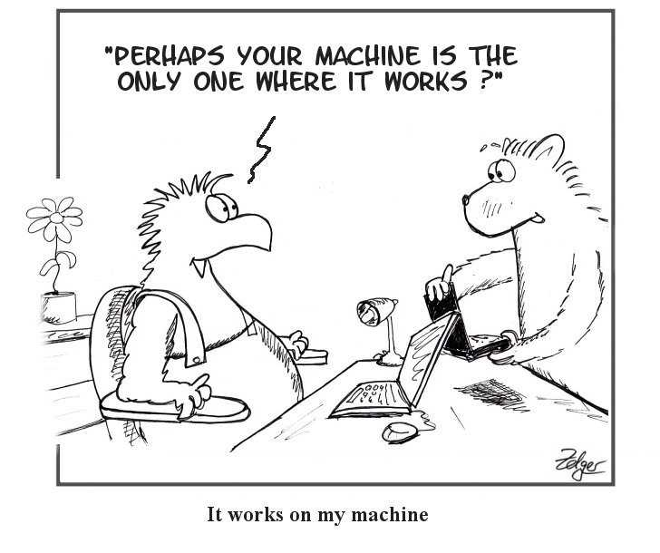
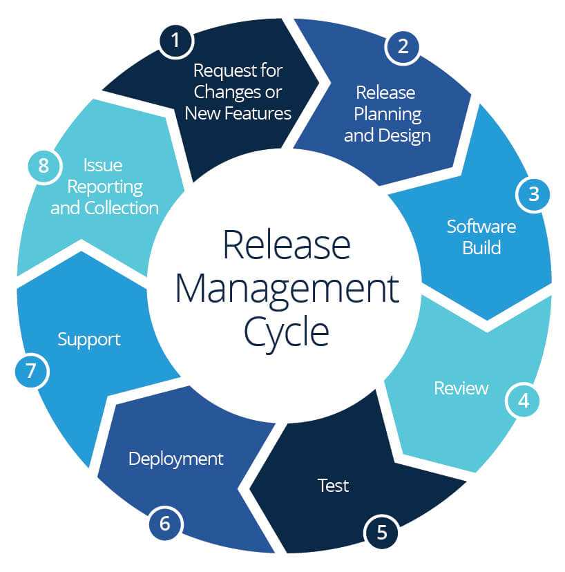

The evolution of software might be a story of innovation in delivery channels - the mainframe to the
personal computer, hardware-specific applications to cross-architecture compilation, desktop to
mobile, on-premise to cloud. These new delivery methods represented a unique opportunity for
developers to reach more users with the same application. The benefits are obvious: write once, make
available anywhere. We might use the word **portability**, then, in very general terms, as a
characteristic of software: highly portable software can be written once and deployed anywhere.

{/* truncate */}

Portable applications require less development and operational effort even as they are exposed to
more potential users. This same value, though, also applies to the internal operations of software
teams. In modern microservice architectures, developers also play the role of consumers- consuming
the services and APIs created by other teams both inside and outside of their organization. Thus,
application portability matters significantly to the internal operations of software companies.

Today, we'll shed light on what portability means in the context of cloud software and why it's
important for both your customers and your team members.

## "It works on my machine"

Software teams generally use the word “environment” to describe the context in which an application
runs. It's a broad term- you might use it to refer to a specific machine, an OS, or an entire
network. Importantly, the word captures a fundamental concept with a serious implication: context
differs across environments, and if your software depends on context, its behavior will differ
across environments! This distinction is often the culprit of poorly functioning software: it
seemingly works in one place but is buggy when you run it somewhere else.

Picking apart the logic of your software from the characteristics of the environment is a central
skill in developing any software application, and it's a skill that strives toward the above prize:
portability. A developer who has isolated their software from its environment finds themselves with
an elegant bundle of business logic that will behave the same regardless of where it is run: their
own machine, the company QA environment, their production cloud, even their customer's cloud!

## Who benefits from software portability

### IT departments: commoditizing cloud providers

A smart business will limit its hard dependencies if given the chance. Vendor lock-in introduces a
central point of failure that exposes a company both to disruptions in service and the pricing whims
of the vendor. Horizontal application portability is characterized by minimizing environment
switching costs such that an IT department can avoid vendor lock-in. If you can run your application
just as easily on GCP or AWS you avoid pinning your company to the uptime and pricing of one cloud
provider.

### Developers and DevOps: building and releasing extensible services

It is not uncommon for environments to multiply rapidly in even small software teams. Developers
need to run the application locally, quality engineers in a test environment, sales reps in a demo
environment, and operators run the application in staging and production.

The develop/test/demo/deploy lifecycle has a cost that is directly correlated to the portability of
the application. Software that requires much environment-related configuration and tuning will cost
time and effort as new versions move through the lifecycle. Portability saves time and mental
overhead for anyone involved in moving new versions of the software across environments.

### Sales: increasing addressable market

Many potential customers prefer to run vendor software on their own premises for security reasons.
If a business makes rigid software - requiring specific operating systems, cloud providers, embedded
security, and extensive environment configuration - the business is inadvertently limiting its
addressable market to those customers that satisfy these conditions. A company that ships portable
software, on the other hand, removes these restrictions on their addressable market.

## The three dimensions of software portability

Building software that is portable actually encourages patterns that support a host of other
worthwhile properties. Suppose you make it easier for your software to be run here or there. It
follows that it is easier to run it here and there: supporting replication within and across
environments and enabling engineers across teams and orgs to operate the software themselves. An
application that provides full portability and is easy for developers to run is easier to build on
top of. An application with great portability lends itself to great extensibility.

So how do we know if our apps and services are portable? Can they be portable in some ways and not
others? To determine this for ourselves, let's evaluate three different dimensions in which our
application can be portable:

### 1. Replication (deep)

The first dimension of portability is crucial to operating cloud applications at scale – scaling and
replication. The ability for your service to maintain multiple running instances that work as a
cohesive unit is paramount to its ability to support concurrent users at scale. Consistent packaging
mechanics, like VM images and containers, are often the key to automating the replication of
services in cloud environments at scale. Still, this replication demands consistent methods for load
balancing and distributing incoming traffic. By combining packaging consistency with API gateways,
service meshes, and other load balancing solutions, teams can quickly achieve deep application
portability.

### 2. Platform/provider migration (horizontal)

The second dimension of portability is typically the first that most think of when they consider
cloud portability - cloud migration and/or multi-cloud deployments. The ability for your application
to be run on multiple platforms is a great defensive strategy. It ensures that cloud apps can remain
cost-effective and protected from outages. Designing applications to be run on commodity
infrastructure (e.g., Linux vs. Windows) or on multiple cloud providers (e.g., AWS vs. Azure vs.
GCP) enables teams to run in multiple locations concurrently or swap out providers should pricing
prove beneficial.

### 3. Development lifecycle (vertical)

The third dimension of portability is often overlooked despite being far more impactful than
horizontal mobility. This is portability through the software development release cycle. Software
developers are constantly building or modifying services inside an application stack. As such, they
find themselves needing to test in environments that they can be sure will match production. The
consistency of the application context from local development, through test/QA/staging, and finally
to production environments is crucial to ensuring trust, maintaining a strong development flow, and
ensuring that product features get in front of customers quickly and safely.

## History and future

The yearning for portable software is not new. The development of the Java Virtual Machine is among
the most successful software portability innovations to date. Now, any machine can run a single
compiled .jar file and any OS and display identical behavior. With Docker, applications can go a
step further: an entire OS can be shipped as a lightweight artifact and run anywhere.

Note the caveats, and note the seeming inconsistencies with the entire concept of portability! If
java needs a JVM installed, isn't that a hard violation of everything we've discussed? Alas, it
seems so. Here lies another, related- even inverse- concept to portability: the platform. Portable
software still needs be executed by something; a platform, an OS, an environment. As developers
struggle to make their applications more portable, companies struggle to make the “universal
platform” on which all applications might be run portable. Microsoft tried it with an OS, Oracle
with a narrow VM, Docker with a more general VM, and most recently Kubernetes with an open-source
hardware abstraction and Terraform/Cloudformation with reproducible infrastructure-as-code
templates.

## True portability

Are applications truly portable? The best way to answer that is to look at our own applications. Are
my applications portable? Can I share my application with other developers? Can they run or access
it using their own tools and hardware?

The industry has made enormous strides toward allowing cloud software to become portable. With each
innovation comes a new opportunity for software architecture to push the boundaries even further.
Yesterday I could make a portable monolithic application by putting it in an AMI or Docker image.
Today my app contains multiple images that run separately yet still need to connect together. The
pursuit of portability is an ever ongoing effort, but the value of the pursuit always remains.
