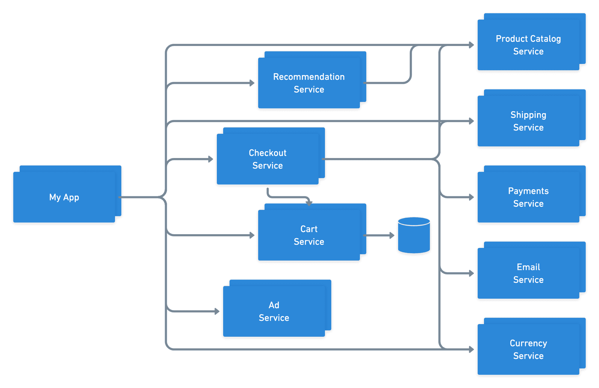

It's been seven years since Docker was first announced at PyCon, and containers have since inspired
sweeping changes in the roles and responsibilities of DevOps engineers around the world. The
performance optimizations of a shared OS with the help of an open-source engine gave many developers
their first taste of production-ready virtualization; making virtualization approachable to the devs
writing the applications proved to be just the kick we needed to move us into the cloud-native
landscape we see today.

{/* truncate */}

In recent years, containerization has become the go-to packaging mechanic enabling portability from
local development to production and alleviating teams of several reasons why something might “work
on my machine” but not anywhere else. The natural trust that teams get from this kind of portability
has similarly inspired us to be bolder with how we design applications – yielding a boom of
microservice architectures, service-oriented design, and cloud-native development.

While this new-found portability and trust has been a valuable enabler, our resulting pursuit of
cloud-native development has created its own set of hurdles. While we've developed trust in our
virtualization and enabled developers to create their own services, the applications we've built
have become vastly more complex. As we look back at these increasingly complex applications, we must
ask ourselves if they're still as portable as they were seven years ago.

## Are our apps portable?

The short answer: sometimes yes, sometimes no. While Docker has allowed us to create portable images
that can run on a variety of hardware and operating systems (personal machines included), not every
app consists of a single Docker image.

### Containers are portable...

Apps that consist of a single container are already portable. Developers can make use of the Docker
engine to run the application as easily on private environments as can be done in production. This
makes the container portable vertically through the release process as well as horizontally across
cloud providers.

### ...apps are not

Cloud-native, multi-service applications are not portable out of the box – at least not as a unit.
While each individual service can maintain it's own pipeline and be released into de-coupled and
autonomous scaling groups, the final user-facing application often has implicit dependencies on many
different systems in order to fulfill its duties.

This complexity is unreasonable, and often impossible, for any single developer to keep track of.
They know how to run and operate the service(s) that their team created, but often rely on mock
responses or shared QA environments for testing and debugging integrations with peers. This means
that apps aren't being run end-to-end until all the services reach a shared, static environment, and
this environment is locked to the tools and technology that were setup when it was created. As a
result, these apps aren't portable vertically or horizontally like the containers that power each
service are.

## Make apps portable with network-awareness

If our individual containers are each portable on their own but together are not, what differences
exist between the final application and the individual containers that are preventing us from
vertical and horizontal mobility? The answer becomes clear when you step back and look at the two
examples above – the networking.

In distilling the application down to the containers and relationships between them, we can see that
what we're left with is a series of nodes and edges – just like any other graph. While the nodes of
this graph are independently portable, the edges are the key bit of information preventing us from
achieving the full application portability we hoped to get from containerization.

So how do we acquire the information about the relationships between these services? These
relationships didn't materialize to power our applications by accident, so what source of truth
maintains this knowledge, and how do we collect it so we can make this app portable?

While there may not be a single source of truth like one would hope for end-to-end insights into
application networking, this information can fortunately be derived from the many existing
contributors to the application – the creators of each service. By appending the awareness of
traffic coming from each service to the existing Docker images, we can easily extrapolate global
relationships for the application to get full insights into all expected traffic for the app as a
whole.

## Doesn't this sound familiar?

While the use case for cloud-native apps is heavily weighted toward networking, the concept we've
just described is one we use every day: dependencies. Every language, framework, and operating
system has introduced one or more ways for developers to build on top of the work of others by
asserting and resolving dependencies, and it seems only natural that we adopt the same patterns for
building upon cloud services. By re-using interface elements of solutions like NPM, pip, RubyGems,
and others, we can support structured relationships between microservices and traverse these
relationships to derive everything each service needs in order to run!

## Dependencies can't be resolved until they are running

Even though these tools provide an ideal developer experience, they unfortunately were not designed
to support microservices dependencies. While you could repurpose the tools to host artifacts, serve
them, and index the relationships between them, the container artifacts that would be downloaded
can't simply be imported into your application like language-specific libraries can. When it comes
to microservices, each service is designed to be an independent unit that can run and scale entirely
on its own. What this means for a dependency resolver is that services aren't ready to fulfill
traffic and handle incoming requests simply because the artifacts have been downloaded – they have
to be running too.

## What do we need in order to resolve cloud dependencies?

Since services have to be running before calls can be made to them, the earliest point in an
application lifecycle in which we can safely resolve microservice dependencies is deploy-time. It is
at deploy time that we know both the relationships between services and the tools/state of the
target environment allowing us to properly resolve and de-duplicate resources and services. In order
to properly broker this deployment to account for multiple services working together, we need to set
up our pipeline with a few key expectations about the target environment:

### 1. A way to run services (e.g. container platform)

As we stated earlier, each individual container is already portable and can be run on a variety of
different hardware and cloud hosting providers. The process we use to start one container can
therefore be performed on many containers sequentially to achieve the same results for multi-service
applications. Simply target your favorite container platform like Kubernetes, OpenShift, or AWS ECS,
and said platform will be able to setup replicasets for every service in your stack.

### 2. A way to connect services together (e.g. service discovery / service mesh)

Now that we have a way of running each service, we need a standardized way of connecting them
together over a network. Fortunately the problem of cloud networking has had a lot of love in recent
years, and we now have a number of tools we can use to instrument service discovery and networking
rules across our application. Most recently we've seen a wave of innovative solutions in the newly
defined category of service meshes that are designed specifically to broker traffic between services
inside an app safely and consistently.

Armed with end-to-end knowledge of a dependency graph, service discovery or service mesh solutions
can be easily configured and re-configured with each deploy to ensure that services can
automatically connect with one another.

## What else does a dependency graph let us automate?

Running and connecting nodes are the minimum viable components of a running application, but
operating highly available, production-grade systems takes a bit more effort. Fortunately, knowledge
of the relationships between services affords us the ability to automate a lot more than just the
provisioning of the basic application:

### 1. Generate network policies & certificates

Due to the difficulty brokering collaboration in cloud environments and properly locking down
network traffic, most systems operate with the “walled garden” approach to cloud security – heavily
securing traffic entering and exiting a firewall, but allowing free-flowing connections between
services once inside. While this enables teams to make calls to peer services without heavy
coordination, it also means that any weakness in the firewall exposes access to the entire system.

Knowledge of a dependency graph and relationships between services in an application afford teams
the ability to automatically set up ingress and egress policies between services and leverage a
zero-trust security model instead of the walled garden approach. Whether it's setting up Kubernetes
NetworkPolicy resources enforced by Cilium, or generating unique credentials for each service
relationship, the only way to set up correct rules is by knowing what traffic patterns are allowed –
something teams get automatically when mapping dependencies.

### 2. Automate observability & traceability

An additional hurdle that gets introduced by distributed systems compared to their monolithic peers
is the new-found difficulty observing application behavior and tracing requests. Different
programming languages and frameworks have their own stack traces that can tell you what happened
during a requests lifecycle, but when requests make calls to many different services to perform
their tasks, the stack trace of each becomes less and less valuable.

Fortunately the cloud-native ecosystem has delivered a number of amazing observability tools to help
teams instrument tracing (check out the OpenTelemetry project!). With knowledge in advance of the
dependency graph, these tools can be automatically instrumented with your deployments and configured
to consolidate logs corresponding with requests that leap between multiple services.

### 3. Protect against version shifting

Active cloud-native applications have hundreds of thousands of engineers collaborating on dozens of
different microservices, and as such each is often released via independent deployment pipelines to
give each team autonomy. When some of these services are consumed by others however, it is left up
to the service being called to either a) maintain its API contract perfectly, or b) collaborate with
every upstream team to ensure they are prepared to handle impending changes. Without proper
coordination, it's easy for breaking releases to make their way into shared environments and cripple
upstream callers that aren't prepared for the changes.

Mitigating issues with service versioning has been a value-add of dependency managers for years. It
can also be applied to cloud environments! With each upstream caller citing the version (or semantic
version) of their dependencies, deploy processes are able to triage these relationships and ensure
that each caller is able to consume changes before rolling out updates that could otherwise tear
down entire products or regions.

## In closing...

Obviously, Docker didn't “forget” to add network dependencies to their product. However, their
success has led to such widespread adoption of service-oriented design that we find ourselves with
new problems. These problems can be solved by continuing the pursuit of portability that Docker and
other virtualization tools started.

Despite the literature around decoupling the world of microservices, it's clearly natural for
developers and teams to build upon the work of others to make bigger and better software together.
In an effort to maintain the portability that containers provided, we need to lean into service
dependencies and set up the same systems and methods we have in lower-level systems. By doing so, we
will achieve the collaboration benefits provided by package managers. We'll also finally be able to
ship services that others can run! It's time we had a dependency resolver for microservices.
