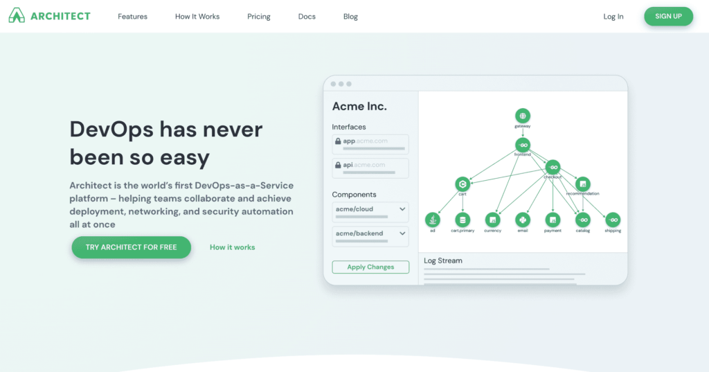

We are pleased to announce the open beta release of Architect's DevOps-as-a-Service platform – a
groundbreaking continuous delivery toolset that helps teams achieve deployment, networking, and
security automation on a distributed architecture, all at once. Through our unique incorporation of
dependency management into the deployment process, even the most complex stacks can be deployed to
your favorite cloud provider with the push of a button!

{/* truncate */}

## What is DevOps-as-a-Service?

DevOps-as-a-Service is our unique take on continuous delivery that aims to do more than deploy a
single microservice to a container platform. Armed with an understanding of your system's dependency
graph, Architect automates the deployment of distributed services, configures secure network
policies, and enables on-demand stacks across all of your environments. DevOps-as-a-Service unlocks
the potential of cloud-native developers and by supporting our over-worked and under-staffed DevOps
teams.

### Empowering cloud-native developers

The microservice paradigm has shattered monolithic applications into complex webs of
service-oriented infrastructure. While this shift is advantageous to the software architect, making
microservices are extensible, portable, and reusable, it introduces a host of new operational
challenges to the developer.

DevOps-as-a-Service provides an easy way for developers to assert and connect to their dependencies.
This approach to dependency management should be familiar to any developer who's used a
[package manager](https://en.wikipedia.org/wiki/Package_manager) or
[dependency injection](https://en.wikipedia.org/wiki/Dependency_injection).

### Reducing the strain on DevOps

DevOps-as-a-Service provides a lever to DevOps teams through a powerful blend of automation and
self-service. Automated provisioning and updating of environments alleviates teams from manual
pipelining while automation of network policies precludes the vulnerabilities of a hand-drawn
policy. Hooks into the ingress/egress for services across environments lets DevOps experiement with
the latest production tools to support their developers!

## What can DevOps-as-a-Service do?

Our vision for Architect is to incorporate a wide array of production-grade tools, enroll an array
of open-source microservices into a component registry, and generally improve the lives of engineers
building and maintaining cloud-native applications. Today, Architect provides three concrete
benefits:

### Private developer environments

DevOps-as-a-Service completely democratizes application deployments, allowing any developer to
deploy any service for any reason. This freedom makes it extremely easy for developers to spin up
local or private developer environments without needing to be intimately aware of how each
dependency behave. Simply run `architect deploy` and you're off to the races!

### Automated preview environments

Just like developers can spin up environments for private use, they can drop the same
`architect deploy` command into a CI pipeline to auto-provision environments on-commit or on-review.
By integrating directly into GitOps flows, developers can automatically share live URLs for
managers, reviewers, and testers. As soon as they're done, teardown is just as easy.

### Application visibility and security

With each deployment, our platform analyzes dependencies to determine what needs to be deployed. In
doing so, the platform is automatically able to show operators the full scope of changes that need
to be made, like any infrastructure-as-code solution. Architect automatically enriches the
deployment with strict network policies to restrict network traffic. Since each component is aware
of its own dependencies, network visualization and security comes free!

---

Looking to take the strain off your DevOps team and help your developers create and test
microservices? We'd love to hear from you! Shoot us a note at
[support@architect.io](mailto:support@architect.io), or feel free to try out some of our code
samples yourself!
