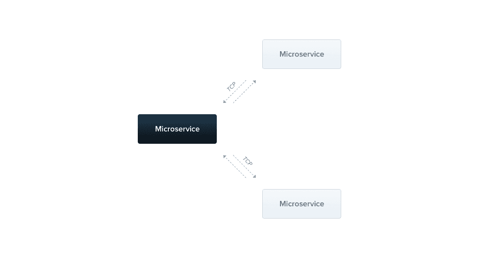

Microservices can seem intimidating at first, but at the end of the day they're just regular
applications. They can execute tasks, listen for requests, connect to databases, and everything else
a regular API or process would do. We only call them microservices colloquially because of the way
we use them, not because they are inherently small.

In this tutorial we'll demystify the creation and operation of microservices for Node.js developers
by creating a microservice using a popular Node.js framework, [NestJS](https://nestjs.com/). We
won't go into detail about the design or architecture of NestJS applications specifically, so if
you're unfamiliar with the framework I'd recommend you check out its docs first, or simply skip to
another one of our [Node.js samples](https://github.com/architect-community/react-app) that uses
[Express](https://expressjs.com/) directly.

{/* truncate */}

_Want to skip to the source code?
[Click here](https://github.com/architect-community/nestjs-microservices)._

## Creating a NestJS microservice

NestJS is an opinionated framework for developing server-side Node.js applications, including, but
not limited to, microservices. Their default walk throughs and tutorials all show how to create and
operate a REST API using NestJS, but in this tutorial we'll show how to use some of their other
helpful microservice libraries to create and operate a TCP-based microservice.



To start, let's download NestJS's CLI to help us bootstrap our new microservice project. The CLI
will do all the work to build the project skeleton making it a lot easier for us to make the changes
we need:

```bash
$ npm i -g @nestjs/cli
$ nest new nestjs-microservice
```

Once the application has been fully initialized, we're going to install the NestJS microservices
library to help us modify the boilerplate application from an http-based REST API to a TCP-based
microservice:

```bash
$ npm i --save @nestjs/microservices
```

Once installed, go ahead and replace the contents of your `src/main.ts` file with the following:

```js
import { NestFactory } from '@nestjs/core';
import { Transport } from '@nestjs/microservices';
import { AppModule } from 'src/app.module';

async function bootstrap() {
  const port = process.env.PORT ? Number(process.env.PORT) : 8080;
  const app = await NestFactory.createMicroservice(AppModule, {
    transport: Transport.TCP,
    options: {
      host: '0.0.0.0',
      port,
    },
  });
  await app.listen();
  console.log('Microservice listening on port:', port);
}
bootstrap();
```

If you're already familiar with NestJS, this file should be easy to read through. The only unique
part is how we're initializing the application – instead of using the default `NestFactory.create()`
method, we're using `NestFactory.createMicroservice()` which provides us additional controls over
the protocols and contracts our application responds to:

```js
const app = await NestFactory.createMicroservice(AppModule, {
  transport: Transport.TCP,
  options: {
    host: '0.0.0.0',
    port,
  },
});
```

In the above snippet, we're declaring that our microservice responds to `TCP` requests and listens
on our configurable port (defaults to `8080`). This means our service won't be a REST API but will
respond to a more raw request format.

Next, let's take a look at the generated controller which defines the routes and methods our API
responds to, `src/app.controller.ts`. Since our microservices respond to TCP requests instead of
HTTP, we'll need to change the annotations on our controller methods to respond to more relevant
request structures. Go ahead and paste the contents below into the file:

```js
import { Controller } from '@nestjs/common';
import { MessagePattern } from '@nestjs/microservices';

@Controller()
export class AppController {
  @MessagePattern({ cmd: 'hello' })
  hello(input?: string): string {
    return `Hello, ${input || 'there'}!`;
  }
}
```

As you can see, the way we define and annotate NestJS controllers remains the same as the generated
project code, but the way we annotate methods within our controllers is different. Instead of using
`@Get()`, `@Post()`, and other HTTP-specific annotations, we define our TCP interfaces using
`@MessagePattern()` - an annotation that maps controller methods to incoming requests so long as
they match the provided pattern. In our case, we've defined the pattern to be any request that
contains `{ cmd: 'hello' }`. We also expect the request payload to be an optional string that will
be used to enrich our response:

```js
hello(input?: string): string {
  return `Hello, ${input || 'there'}!`;
}
```

Great! Now let's make sure our microservice will start up. Our NestJS project came pre-baked with a
`package.json` file that includes all the appropriate start commands, so let's use the one designed
for local development:

```sh
$ npm run start:dev
[5:41:22 PM] Starting compilation in watch mode...
[5:41:27 PM] Found 0 errors. Watching for file changes.
[Nest] 6361   - 08/31/2020, 5:41:28 PM   [NestFactory] Starting Nest application...
[Nest] 6361   - 08/31/2020, 5:41:28 PM   [InstanceLoader] AppModule dependencies initialized +20ms
[Nest] 6361   - 08/31/2020, 5:41:28 PM   [NestMicroservice] Nest microservice successfully started +8ms
Microservice listening on port: 8080
```

Now that we know the application boots correctly, let's build a `Dockerfile` for the service.
Creating a `Dockerfile` will allow our service to be built into a portable, scalable image that
anyone (or any machine) can run consistently without issues. This means we'll be able to run it
ourselves in a stable virtual environment, we'll be able to hand it off to team members to test more
easily, and we'll be able to deploy it to production-grade environments with ease.

Our `Dockerfile` will inherit from an open-source node image, install npm modules, and will run our
`npm run build` command to transpile our typescript and minimize the code footprint. Simple copy the
file contents

```dockerfile
# Start with a Node.js base image that uses Node v13
FROM node:13
WORKDIR /usr/src/app

# Copy the package.json file to the container and install fresh node_modules
COPY package*.json tsconfig*.json ./
RUN npm install

# Copy the rest of the application source code to the container
COPY src/ src/

# Transpile typescript and bundle the project
RUN npm run build

# Remove the original src directory (our new compiled source is in the `dist` folder)
RUN rm -r src

# Assign `npm run start:prod` as the default command to run when booting the container
CMD ["npm", "run", "start:prod"]
```

## Creating a client service

Knowing that our microservice is booting up properly is great, but the best way to test it in a
practical setting is to see if we can extend it from another microservice. So let's go ahead and
create one!

Just like with the previous service, let's start by creating a new NestJS project:

```sh
$ nest new client
```

Let's also install two additional NestJS libraries. The first is the config library to make it
easier to parse and manage application variables, and the second is the microservices library which
contains several helper methods that can be used to more easily access other NestJS microservices:

```sh
$ npm i --save @nestjs/config @nestjs/microservices
```

Now that we have our required libraries installed, let's use them both together to create a client
service for accessing the microservice we created in the previous step. Open up `src/app.module.ts`
and paste in the following contents:

```js
import { Module } from '@nestjs/common';
import { ConfigModule, ConfigService } from '@nestjs/config';
import { ClientProxyFactory, Transport } from '@nestjs/microservices';
import { AppController } from './app.controller';

@Module({
  imports: [ConfigModule.forRoot()],
  controllers: [AppController],
  providers: [
    {
      provide: 'HELLO_SERVICE',
      inject: [ConfigService],
      useFactory: (configService: ConfigService) =>
        ClientProxyFactory.create({
          transport: Transport.TCP,
          options: {
            host: configService.get('HELLO_SERVICE_HOST'),
            port: configService.get('HELLO_SERVICE_PORT'),
          },
        }),
    },
  ],
})
export class AppModule {}
```

The first thing to note from the file contents above is the import of the config module. This import
allows the `ConfigService` to be utilized throughout our application module:

```js
imports: [ConfigModule.forRoot()];
```

The next addition to the file is the `HELLO_SERVICE` provider. This is where we use
`ClientProxyFactory` from the nest microservices library to create a service that allows us to make
calls to our other microservice:

```js
{
  provide: 'HELLO_SERVICE',
  inject: [ConfigService],
  useFactory: (configService: ConfigService) => ClientProxyFactory.create({
    transport: Transport.TCP,
    options: {
      host: configService.get('HELLO_SERVICE_HOST'),
      port: configService.get('HELLO_SERVICE_PORT'),
    },
  }),
}
```

In the above snippet, we're registering a `ClientProxy` instance to the provider key `HELLO_SERVICE`
that points to `HELLO_SERVICE_HOST` listening on `HELLO_SERVICE_PORT`. These two values come from
the ConfigService we imported earlier, and the values are loaded up from environment parameters.
This kind of parameterization is crucial to enable us to run the service in multiple environments
(like dev, staging, and production) without code changes.

Now that we've successfully created our proxy instance, let's open up `src/app.controller.ts` and
set it up with our proxy methods. Paste the following content into the file:

```js
import { Controller, Get, Inject, Param } from '@nestjs/common';
import { ClientProxy } from '@nestjs/microservices';

@Controller('hello')
export class AppController {
  constructor(@Inject('HELLO_SERVICE') private client: ClientProxy) {}

  @Get(':name')
  getHelloByName(@Param('name') name = 'there') {
    // Forwards the name to our hello service, and returns the results
    return this.client.send({ cmd: 'hello' }, name);
  }
}
```

The first thing you'll see is that we've injected an instance of our client proxy into the
controller. We registered with client under the key `HELLO_SERVICE`, so this is the key we use to
indicate which client instance we want injected:

```js
constructor(
  @Inject('HELLO_SERVICE') private client: ClientProxy
) {}
```

Armed with a client that points to our TCP microservice, we can start sending requests that match
the `@MessagePattern` we defined in the service:

```js
@Get(':name')
getHelloByName(@Param('name') name = 'there') {
  // Forwards the name to our hello service, and returns the results
  return this.client.send({ cmd: 'hello' }, name);
}
```

The line above listens for incoming GET requests on `/hello/:name`, formats and forwards the request
to our downstream TCP-based microservice, and returns the results.

Just like with our downstream microservice, let's create a `Dockerfile` for this new service so that
it can be built into an image, run by other team members, and deployed to production. Since this is
also a NestJS application, we can use the same `Dockerfile` we used with our previous service:

```js
# Start with a Node.js base image that uses Node v13
FROM node:13
WORKDIR /usr/src/app

# Copy the package.json file to the container and install fresh node_modules
COPY package*.json tsconfig*.json ./
RUN npm install

# Copy the rest of the application source code to the container
COPY src/ src/

# Transpile typescript and bundle the project
RUN npm run build

# Remove the original src directory (our new compiled source is in the `dist` folder)
RUN rm -r src

# Assign `npm run start:prod` as the default command to run when booting the container
CMD ["npm", "run", "start:prod"]
```

## Running both services together

As you may have noticed, we haven't yet tested our new client service. While it also has an
`npm run start:dev` command like our TCP-based service, we need to make sure the TCP service is
running and that it's host/port values can be assigned as environment parameters in our client
service. This means that deploying our client service includes a few extra steps beyond just npm
`run start:dev`.

There aren't very many manual steps involved with running our two microservices locally, but would
that still be true if our TCP service had it's own set of dependencies? What happens if it needs a
database, or access to another API? The set of manual steps required to deploy continues to compound
exponentially with each new dependency. This kind of API dependency resolution is exactly what
Architect was designed for, so we're going to use it to ensure both our services can be run at the
same time and automatically connect to each other with a single command.

In order to make use of Architect to deploy both services in unison, we'll be creating
`architect.yml` files for each that describes it as a component. Architect Component's are fully
contained, deployable units that include both the details on how to run services as well as an
inventory of the dependencies that each service requires. By capturing the set of dependencies,
Architect can automatically deploy and resolve dependency relationships without needing to spin
everything up in multiple steps.

Let's start with our TCP-based microservice. Go ahead and paste the following into an
`architect.yml` file at the root of the TCP service project directory:

```yml
# Meta data describing our component so others can discover and reference it
name: nestjs-simple
description: Simple NestJS microservice that uses TCP for inter-process communication
keywords:
  - nestjs
  - examples
  - tcp
  - microservices

# List of microservices powering our component
services:
  api:
  	# Specify where the source code is for the service
    build:
      context: ./
    # Specify the port and protocol the service listens on
    interfaces:
      main:
        port: 8080
        protocol: tcp
        ingress:
          subdomain: main
    # Mount our src directory to the container and use our dev command so we get hot-reloading
    debug:
      command: npm run start:dev
      volumes:
        src:
          host_path: ./src/
          mount_path: /usr/src/app/src/
```

The manifest file above does three things:

1. Declares a name, description, and keywords for the component so that others can discover and
   refer to it
2. Outlines the services our component needs in order to operate, and
3. Declares interfaces that others can connect to from outside the component boundaries

Armed with this simple manifest file, we can deploy our component locally and to the cloud without
any further code changes. Let's try it out by installing the CLI and testing out our component:

```sh
# Install the Architect CLI
$ npm install -g @architect-io/cli

# Link the component to our local registry
$ architect link .
Successfully linked nestjs-simple to local system at /Users/username/nestjs-microservice

# Deploy the component and expose the `main` interface on `http://app.localhost/`
$ architect dev nestjs-simple:latest
Using locally linked examples/nestjs-simple found at /Users/username/nestjs-microservice
http://app.localhost:80/ => examples--nestjs-simple--api--latest--qkmybvlf
http://localhost:50000/ => examples--nestjs-simple--api--latest--qkmybvlf
http://localhost:80/ => gateway
Wrote docker-compose file to: /var/folders/7q/hbx8m39d6sx_97r00bmwyd9w0000gn/T/architect-deployment-1598910884362.yml

[9:56:15 PM] Starting compilation in watch mode...
examples--nestjs-simple--api--latest--qkmybvlf_1  |
examples--nestjs-simple--api--latest--qkmybvlf_1  | [9:56:22 PM] Found 0 errors. Watching for file changes.
examples--nestjs-simple--api--latest--qkmybvlf_1  |
examples--nestjs-simple--api--latest--qkmybvlf_1  | [Nest] 32   - 08/31/2020, 9:56:23 PM   [NestFactory] Starting Nest application...
examples--nestjs-simple--api--latest--qkmybvlf_1  | [Nest] 32   - 08/31/2020, 9:56:23 PM   [InstanceLoader] AppModule dependencies initialized +29ms
examples--nestjs-simple--api--latest--qkmybvlf_1  | [Nest] 32   - 08/31/2020, 9:56:23 PM   [NestMicroservice] Nest microservice successfully started +16ms
examples--nestjs-simple--api--latest--qkmybvlf_1  | Microservice listening on port: 8080
```

Now that we know our TCP-based service can be deployed via Architect, let's go ahead and create a
second component to represent our upstream, REST API (our client). Since this component needs to
connect to the previous one, we'll be using Architect's `dependencies` field in our `architect.yml`
file to indicate that we need the TCP service available to connect to. Paste the following into
another `architect.yml` file in the REST API project root directory:

```yml
# architect.yml
name: nestjs-simple-client
description: Client used to test the connection to the simple NestJS microservice
keywords:
  - nestjs
  - examples
  - microservice
  - client

# Sets up the connection to our previous microservice
dependencies:
  nestjs-simple: latest

services:
  client:
    build:
      context: ./
    interfaces:
      main:
        port: 3000
        ingress:
          subdomain: client
    environment:
      # Dynamically enriches our environment variables with the location of the other microservice
      HELLO_SERVICE_HOST: ${{ dependencies['nestjs-simple'].interfaces.main.host }}
      HELLO_SERVICE_PORT: ${{ dependencies['nestjs-simple'].interfaces.main.port }}
    debug:
      command: npm run start:dev
      volumes:
        src:
          host_path: ./src/
          mount_path: /usr/src/app/src/
```

Just like with the prior component, let's make sure we can deploy the new component with Architect.

```sh
# Link the component to our local registry
$ architect link .
Successfully linked nestjs-simple-client to local system at /Users/username/nestjs-microservice-client

# Deploy the component and expose the `main` interface on `http://app.localhost/`
$ architect dev nestjs-simple-client:latest
Using locally linked examples/nestjs-simple-client found at /Users/username/nestjs-microservice-client
Using locally linked examples/nestjs-simple found at /Users/username/nestjs-microservice
http://app.localhost:80/ => examples--nestjs-simple-client--client--latest--qb0e6jlv
http://localhost:50000/ => examples--nestjs-simple-client--client--latest--qb0e6jlv
http://localhost:50001/ => examples--nestjs-simple--api--latest--qkmybvlf
http://localhost:80/ => gateway
Wrote docker-compose file to: /var/folders/7q/hbx8m39d6sx_97r00bmwyd9w0000gn/T/architect-deployment-1598987651541.yml

[7:15:45 PM] Starting compilation in watch mode...
examples--nestjs-simple-client--client--latest--qb0e6jlv_1  |
examples--nestjs-simple--api--latest--qkmybvlf_1            | [7:15:54 PM] Found 0 errors. Watching for file changes.
examples--nestjs-simple--api--latest--qkmybvlf_1            |
examples--nestjs-simple--api--latest--qkmybvlf_1            | [Nest] 31   - 09/01/2020, 7:15:55 PM   [NestFactory] Starting Nest application...
examples--nestjs-simple--api--latest--qkmybvlf_1            | [Nest] 31   - 09/01/2020, 7:15:55 PM   [InstanceLoader] AppModule dependencies initialized +18ms
examples--nestjs-simple--api--latest--qkmybvlf_1            | [Nest] 31   - 09/01/2020, 7:15:55 PM   [NestMicroservice] Nest microservice successfully started +9ms
examples--nestjs-simple--api--latest--qkmybvlf_1            | Microservice listening on port: 8080
examples--nestjs-simple-client--client--latest--qb0e6jlv_1  | [7:15:55 PM] Found 0 errors. Watching for file changes.
examples--nestjs-simple-client--client--latest--qb0e6jlv_1  |
examples--nestjs-simple-client--client--latest--qb0e6jlv_1  | [Nest] 30   - 09/01/2020, 7:15:56 PM   [NestFactory] Starting Nest application...
examples--nestjs-simple-client--client--latest--qb0e6jlv_1  | [Nest] 30   - 09/01/2020, 7:15:56 PM   [InstanceLoader] ConfigHostModule dependencies initialized +18ms
examples--nestjs-simple-client--client--latest--qb0e6jlv_1  | [Nest] 30   - 09/01/2020, 7:15:56 PM   [InstanceLoader] ConfigModule dependencies initialized +1ms
examples--nestjs-simple-client--client--latest--qb0e6jlv_1  | [Nest] 30   - 09/01/2020, 7:15:56 PM   [InstanceLoader] AppModule dependencies initialized +2ms
examples--nestjs-simple-client--client--latest--qb0e6jlv_1  | [Nest] 30   - 09/01/2020, 7:15:56 PM   [RoutesResolver] AppController {/hello}: +6ms
examples--nestjs-simple-client--client--latest--qb0e6jlv_1  | [Nest] 30   - 09/01/2020, 7:15:56 PM   [RouterExplorer] Mapped {/hello, GET} route +5ms
examples--nestjs-simple-client--client--latest--qb0e6jlv_1  | [Nest] 30   - 09/01/2020, 7:15:56 PM   [RouterExplorer] Mapped {/hello/:name, GET} route +2ms
examples--nestjs-simple-client--client--latest--qb0e6jlv_1  | [Nest] 30   - 09/01/2020, 7:15:56 PM   [NestApplication] Nest application successfully started +3ms
```

As you can see, all it takes is one command to deploy the TCP-service, our upstream HTTP service,
and enrich the networking so that both services are automatically talking to each other. The command
below deploys the `examples/nestjs-simple-client` component locally and exposes the `client`
interface at http://app.localhost/hello/world.

```sh
$ architect dev nestjs-simple-client:latest
```

## Deploying to the cloud

We now know how to run our stack of microservices locally in a repeatable way, but what about
deploying to production-grade environments? How do we deploy all our services to AWS ECS or
Kubernetes? How do we deal with networking and configuration of our services? Fortunately, Architect
has this handled too! Since we already described our services as Architect Components, they are
primed and ready to be deployed to production-grade container platforms without any additional work.

Before you can deploy components to remote environments, you must
[create an account with Architect](https://cloud.architect.io/signup).

Once you've successfully created your account, go ahead and click the button below to deploy it to a
sample Kubernetes cluster powered by Architect Cloud:

If you're already familiar with Architect you can use the CLI instead. Once you've successfully
created your account, go ahead and login using Architect's CLI:

```sh
$ architect login
```

Finally, we're ready to deploy our component! Let's go ahead and try out Architect's community cloud
(example-environment) so that we don't need to create a cluster right away (be sure to replace
`<account>` with your account name). Just like deploying locally, deploying remotely is as simple as
running `architect deploy`:

```sh
$ architect deploy nestjs-simple-client:latest --account="<account>" --environment="example-environment"
Creating deployment... done
Deployment ready for review: https://cloud.architect.io/<account>/environments/example-environment/deployments/<deployment-id>
? Would you like to apply? Yes
Deploying... done
Deployed
```

Congratulations! That's all it takes to take a locally runnable component and deploy it to a remote
cluster with Architect. Once the deployment completes, you'll be able to test it out live via a url.

_Note: You can register your own Kubernetes or ECS cluster on the platforms tab of your account.
Then create an environment for that platform and try deploying again!_

_Note: We skipped the component registration step in this tutorial because we've already published
these two example components to the registry. [Docs](/docs/components/overview#building-components)_
