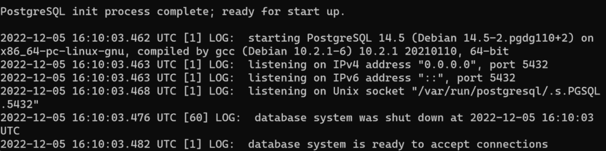
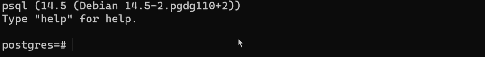
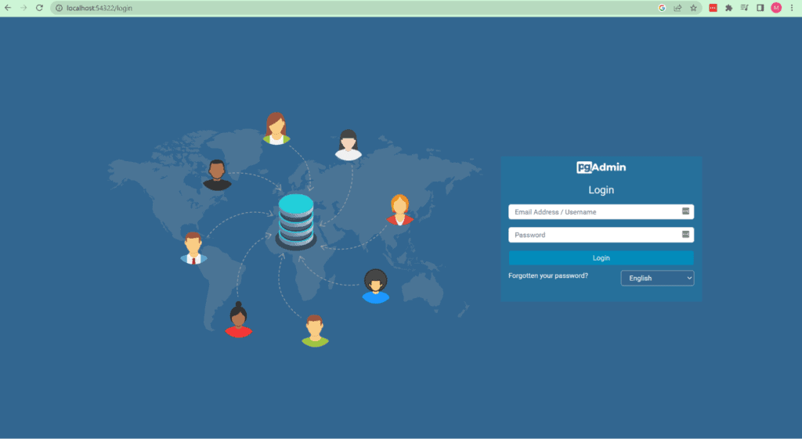
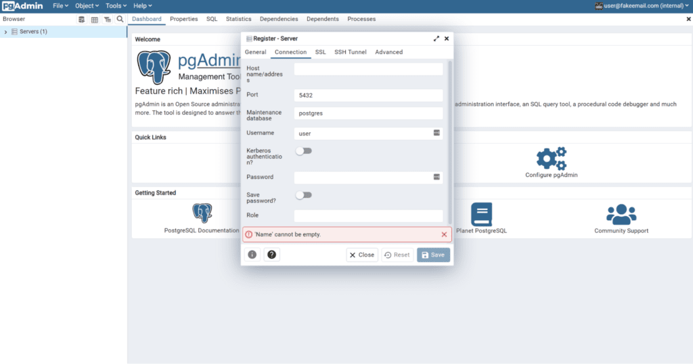

PostgreSQL is an open-source, relational database that can store all the dynamic information
required for your application to operate. Whether you need to store information generated by users
or a list of items you are looking to sell, Postgres is one of the most popular choices by software
engineers.

{/* truncate */}

While cloud providers like AWS make it easy to get running in production with
[RDS](https://aws.amazon.com/rds/postgresql/), the local development experience can be left somewhat
lacking. Some common scenarios that can lead to a loss in development time are:

1.  Needing access to two different versions of Postgres simultaneously
2.  Getting into a bad state due to conflicting local applications
3.  Complex integration testing issues when previous tests are not cleaned up properly

Installing Postgres directly on your machine can make these situations difficult to deal with. This
is where [Docker](https://www.docker.com/) containers come in.

By using a Docker container, you can achieve more fine-grained control over how Postgres is used in
your development environment. Let's look at how you can use Docker to help solve these issues.

Before we get started, you will need to have Docker installed on your machine and a
[free Architect account](https://cloud.architect.io/signup).

## Pick an image for your Postgres container

The first step is to find the image you want to use as the base of your container. The Postgres team
has an [official image](https://hub.docker.com/_/postgres). While there are others you can use, we
always recommend sticking with official images as they tend to be the best supported.

Next, you need to choose a version. Postgres is currently supported up to version 15 using official
images. However, if you look at cloud providers such as AWS or GCP, they currently support up to
version 14. To keep the development environment as close to production as possible, let's use
version 14 locally as well.

With that all figured out, you will use `postgres:14` as your base image for the rest of the
tutorial.

## Run your Postgres container

To spin up your first Postgres container, you can run the command:

```sh
docker run --name my_database -p 5432:5432 -e POSTGRES_PASSWORD=development postgres:14
```

This command will run a new container called `my_database` with port ( `-p`) 5432 in the container
mapped to port 5432 on the host machine. The `-e` switch adds an environment variable called
`POSTGRES_PASSWORD` with a value of “development” and the container will be based on the
`postgres:14` image.

If everything works as expected, you should see the following:



## Create your first connection

With your container running, you can now connect to it for the first time. To do this, you'll use
[`psql`](https://www.postgresql.org/docs/current/app-psql.html), which is a command line tool that
lets you connect to Postgres databases. If you were to install Postgres directly on your machine,
you would already have access to this. Since you are using a Docker container, you need another way
to access it. To accomplish this, you are going to use `docker exec`. This lets you run a command
inside a container that already has the tool installed. In a new terminal, run the following
command:

```sh
docker exec -it my_database psql -U postgres
```

This will tell Docker to run the Postgres CLI tool's to connect to the database inside the
`my_database` container using the `postgres` user.



Now you have full access to the Postgres database. You can create a database using
`CREATE DATABASE some_database_name_here` or exit using `\q`.

## Try out pgAdmin

While `psql` is a great tool, it can be cumbersome to work in. To make your life easier, you can
also use [`pgAdmin`](https://www.pgadmin.org/). This web-based tool allows you to connect to and
manage Postgres databases. Let's spin up a local instance of pgAdmin.

```sh
docker run --name pgadmin -p 54322:80 -e "PGADMIN_DEFAULT_EMAIL=user@fakeemail.com" -e
"PGADMIN_DEFAULT_PASSWORD=development" dpage/pgadmin4
```

This really long command runs a container called `pgadmin`, that is based on the dpage/pgadmin
image. It also publishes port 80 in the container to port 54322 on the host machine, so that you can
interact with PgAdmin from `http://localhost:54322`. Finally, the command also adds two environment
variables that creates the default account that you'll want to log in with.

Once that is done, we can open our web browser to `http://localhost:54322`.



Using the credentials from the command above, you can log in to your user account. From here, your
next step is to add your Postgres container to the list of servers. To do this, you need to
right-click on `Servers` on the left-hand side of the screen and then under `Register`, select
`Server`.



On the `General` tab, you'll need to give the server a name. Once you have done that, switch over to
the connection tab. The first thing to do there is to fill out the `Host name/Address` field. To get
this value, go back to your terminal and run the following command.

```sh
docker inspect -f '{{range .NetworkSettings.Networks}}{{.IPAddress}}{{end}}' my_database
```

Because pgAdmin is running inside a Docker container and your database is also inside a Docker
container, you need to use the internal container IP address to access it. If your program is
running outside of a Docker container, then you can just use `localhost:5432` since you forwarded
the local port to the container when you created it.

For your username, enter `Postgres`, and for your password, put in the value of `POSTGRES_PASSWORD`
from above. In this case, `development`. With all of that set, just click `Save`. You now have
pgAdmin set up to work with your Postgres container!

## Persistent data

With our database running and in use, let's look at where the data is stored. By default, your data
only exists inside the container in the folder `/var/lib/postgresql/data`. So if you were to run
`docker rm my_database` all of your data would be gone. For most use cases, this is fine. However,
if you want to keep your data around, you can solve this using
[Docker volumes](https://docs.docker.com/storage/volumes/). You can tell Docker that you want to
mount a local folder from your machine to the container. You can do this with the `-v` argument. So
your command now looks like this:

```sh
docker run --name my_database -p 5432:5432 -v /home/usr/postgresDatabase:/var/lib/postgresql/data -e
POSTGRES_PASSWORD=development postgres:14
```

Now when Postgres spins up and starts storing information in `/var/lib/postgresql/data`, it is
actually storing that information in `/home/usr/postgresDatabase`. If you run
`docker rm my_database`, the container will no longer exist, but your data will since it is now in a
folder on your local machine and not inside the container.

## Next steps with Postgres and Docker

To recap, you've learned how to run Postgres locally in a Docker container and how to access it
using both `psql` and PGAdmin. You should now be on your way to a more seamless development
experience.

Check out these other posts on the [Architect blog](https://www.architect.io/blog/) to learn more
about testing and containerization:

- [A Developer's Guide to Containers](/blog/2022/10/27/containers-developers-guide/)
- [Feature Announcement: Volumes in the cloud](/blog/2023/01/04/cloud-volumes/)
- [Test Environments: Everything You Need to Know](/blog/2022/08/09/test-environment-guide/)

As always, feel free to hit us up with comments and suggestions below, or on Twitter at
[@architect_team](https://twitter.com/architect_team)!
