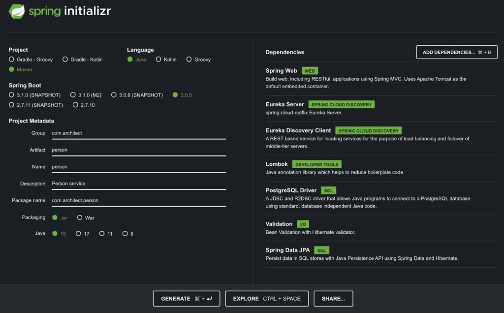
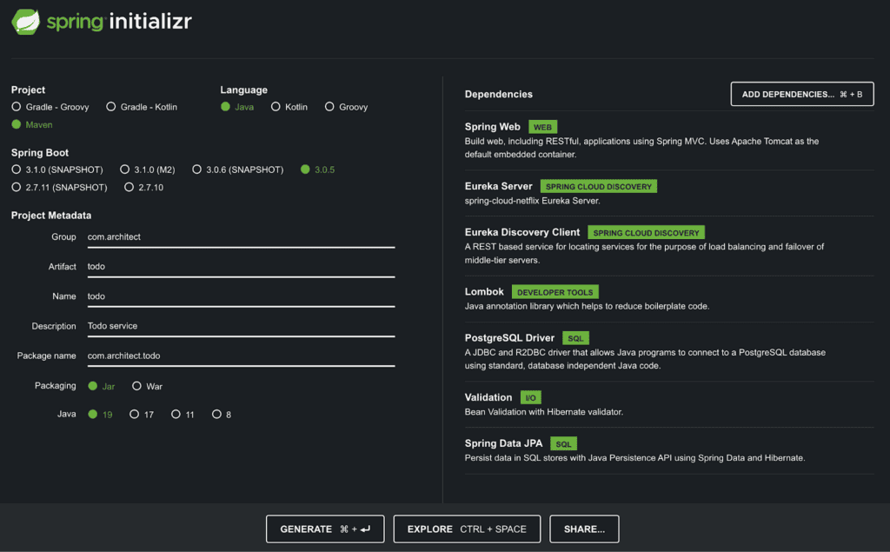

import Tabs from '@theme/Tabs';
import TabItem from '@theme/TabItem';

Microservices are small self-contained services that are independently deployed and communicate over
well-defined APIs. They are highly maintainable and testable and thus can bring great flexibility to
the application. This makes microservices a popular approach in software development. Spring Boot is
one of the best backend frameworks that is easy to build and run microservices. Spring Boot uses
Apache Tomcat by default as a Java web application server to process HTTP requests.

In this article, basic concepts of deploying Microservices with Spring Boot will be covered. The
application that will be built is a to-do web application. There are 2 services to be constructed:
`Todo` and `Person`. The `Todo` service stores to do tasks belonging to a person. The Person service
stores information about a person and communicates with the `Todo` service to retrieve the person's
list of to-dos. Two ways of deployment will be shown to deploy these services. The first way of
deployment uses the popular Eureka as a service registry and the second uses
[Architect.io](https://www.architect.io/) to perform service mesh for the microservices to
communicate with each other.

{/* truncate */}

## Prerequisites

The following tools are needed for this tutorial.

- Docker
- Postgres
- [A free Architect Cloud account](https://www.architect.io/)

## Deploy Spring Boot microservices with Eureka

Eureka is a server registry that registers all client applications. Any clients registered to Eureka
will be able to communicate with one another. In this example, the Eureka server is named
`discoveryservice`, and the clients are `Todo` and `Person`.

The simplest way to start building Spring Boot applications is to use
[Spring Initialzr](https://start.spring.io/). In this case, 3 services are needed: the Eureka
server, the Todo service, and Person service. Provide information about the type of project,
language, Spring Boot version, project metadata, and dependencies for the Eureka server as follows,
and click **GENERATE**.



Similarly, for the `Todo` service:



Place these projects under a directory named `springboot-microservices`. The structure of the
project should looks like:

Place these projects under a directory named springboot-microservices. The structure of the project
should look like:

```
springboot-microservices
├── discoveryservice
├── person
└── todo
```

### Spring Boot service discovery

The service discovery requires Spring Cloud `@EnableEurekaServer` in order to serve as a service
registry. Adding this annotation allows the communication between microservices that are registered
to Eureka. The discovery service application
`discoveryservice/src/main/java/com/architect/discoveryservice/DiscoveryserviceApplication.java`
should look like:

```java
package com.architect.discoveryservice;

import org.springframework.boot.SpringApplication;
import org.springframework.boot.autoconfigure.SpringBootApplication;
import org.springframework.cloud.netflix.eureka.server.EnableEurekaServer;

@SpringBootApplication
@EnableEurekaServer
public class DiscoveryserviceApplication {
  public static void main(String[] args) {
     SpringApplication.run(DiscoveryserviceApplication.class, args);
  }
}
```

Add the following variables to `discoveryservice/src/main/resources/application.properties`.

```properties
server.port=8761
eureka.client.register-with-eureka=false
eureka.client.fetch-registry=false
```

### Todo client service

```
Project directories:
src/main/java/com/architect/todo/
├── TodoApplication.java
├── controller
├── dto
├── model
├── repository
└── service
```

```java
package com.architect.todo;

import org.springframework.boot.SpringApplication;
import org.springframework.boot.autoconfigure.SpringBootApplication;
import org.springframework.cloud.client.discovery.EnableDiscoveryClient;

@SpringBootApplication
@EnableDiscoveryClient
public class TodoApplication {
  public static void main(String[] args) {
     SpringApplication.run(TodoApplication.class, args);
  }
}
```

Create the following files:

<Tabs>
<TabItem value="todo.java" label="model/todo.java" default>

```java
package com.architect.todo.model;

import jakarta.persistence.Entity;
import jakarta.persistence.GeneratedValue;
import jakarta.persistence.GenerationType;
import jakarta.persistence.Id;
import lombok.*;

@Entity
@Data
@NoArgsConstructor
@AllArgsConstructor
@Builder
public class Todo {
  @Id
  @GeneratedValue(strategy = GenerationType.AUTO)
  private Long id;
  private String task;
  private Long personId;
}
```

</TabItem>

<TabItem value="tododto.java" label="dto/TodoDto.java" >

```java
package com.architect.todo.dto;

import lombok.AllArgsConstructor;
import lombok.Builder;
import lombok.Data;
import lombok.NoArgsConstructor;

@Data
@NoArgsConstructor
@AllArgsConstructor
@Builder
public class TodoDto {
  private String task;
}
```

</TabItem>

<TabItem value="todorepository.java" label="repository/TodoRepository.java">

```java
package com.architect.todo.repository;

import com.architect.todo.model.Todo;
import org.springframework.data.repository.CrudRepository;
import org.springframework.stereotype.Repository;
import java.util.List;

@Repository
public interface TodoRepository extends CrudRepository<Todo, Long> {
  List<Todo> findByPersonId(Long personId);
}
```

</TabItem>

<TabItem value="todoservice.java" label="service/TodoService.java">

```java
package com.architect.todo.service;

import com.architect.todo.dto.TodoDto;
import com.architect.todo.model.Todo;
import com.architect.todo.repository.TodoRepository;
import org.springframework.beans.factory.annotation.Autowired;
import org.springframework.stereotype.Service;
import java.util.List;

@Service
public class TodoService {
  @Autowired
  private TodoRepository todoRepository;

  public List<Todo> getTodos(Long personId) {
    return todoRepository.findByPersonId(personId);
  }

  public Todo createTodo(Long personId, TodoDto todoDto) {
    return todoRepository.save(Todo.builder().personId(personId).task(todoDto.getTask()).build());
  }
}
```

</TabItem>

<TabItem value="todocontroller.java" label="controller/TodoController.java">

```java
package com.architect.todo.controller;

import com.architect.todo.dto.TodoDto;
import com.architect.todo.model.Todo;
import com.architect.todo.service.TodoService;
import org.springframework.beans.factory.annotation.Autowired;
import org.springframework.http.ResponseEntity;
import org.springframework.web.bind.annotation.*;
import java.util.List;

@RestController
@RequestMapping("/api/v1/todo-microservice")
public class TodoController {
  @Autowired
  private TodoService todoService;

  @GetMapping
  public ResponseEntity health() {
    return ResponseEntity.ok("Success");
  }

  @GetMapping("/todos/person/{personId}")
  public ResponseEntity<List<Todo>> getTodos(@PathVariable("personId") Long personId) {
    return ResponseEntity.ok(todoService.getTodos(personId));
  }

  @PostMapping("/todo/person/{personId}")
  public ResponseEntity createTodo(@PathVariable("personId") Long personId, @RequestBody TodoDto todoDto) {
    return ResponseEntity.ok(todoService.createTodo(personId, todoDto));
  }
}
```

</TabItem>
</Tabs>

Lastly, application.properties under resources:

```properties
server.port=${SERVER_PORT}
spring.application.name=todo-client
logging.level.org.springframework=ERROR

# eureka
eureka.client.serviceUrl.defaultZone=http://localhost:8761/eureka

# database
spring.datasource.driver-class-name=org.postgresql.Driver
spring.jpa.hibernate.ddl-auto=create
spring.datasource.initialization-mode=always
spring.jpa.properties.hibernate.jdbc.lob.non_contextual_creation=true
spring.jpa.properties.hibernate.dialect=org.hibernate.dialect.PostgreSQLDialect
spring.datasource.platform=postgres
```

Now, the `Todo` service is ready.

### Person client service

```
Project directories:
src/main/java/com/architect/person
├── PersonApplication.java
├── config
├── controller
├── dto
├── model
├── repository
└── service
```

The setup of the `Person` service is similar to the `Todo` client service. There are a few
additional classes needed for the `Person` client service to communicate with the `Todo` client
service such as `RestTemplateConfiguration` which is the central Spring class for client-side HTTP
requests.

Create the following classes:

<Tabs>
<TabItem value="todo.java" label="dto/todo.java">

```java
package com.architect.person.dto;

import lombok.AllArgsConstructor;
import lombok.Builder;
import lombok.Data;
import lombok.NoArgsConstructor;

@Data
@NoArgsConstructor
@AllArgsConstructor
@Builder
public class Todo {
  private Long id;
  private String task;
  private Long personId;
}
```

</TabItem>

<TabItem value="tododto.java" label="dto/TodoDto.java">

```java
package com.architect.person.dto;

import lombok.AllArgsConstructor;
import lombok.Builder;
import lombok.Data;
import lombok.NoArgsConstructor;

@Data
@NoArgsConstructor
@AllArgsConstructor
@Builder
public class TodoDto {
  String personName;
  String task;
}
```

</TabItem>

<TabItem value="persondto.java" label="dto/PersonDto.java">

```java
package com.architect.person.dto;

import lombok.AllArgsConstructor;
import lombok.Builder;
import lombok.Data;
import lombok.NoArgsConstructor;

@Data
@NoArgsConstructor
@AllArgsConstructor
@Builder
public class PersonDto {
  private String name;
}
```

</TabItem>

<TabItem value="RestTemplateConfiguration.java" label="config/RestTemplateConfiguration.java">

```java
package com.architect.person.config;

import org.springframework.boot.web.client.RestTemplateBuilder;
import org.springframework.cloud.client.loadbalancer.LoadBalanced;
import org.springframework.context.annotation.Bean;
import org.springframework.context.annotation.Configuration;
import org.springframework.context.annotation.Primary;
import org.springframework.web.client.RestTemplate;

@Configuration
public class RestTemplateConfiguration {
  @Bean
  @LoadBalanced
  @Primary
  public RestTemplate restTemplate(RestTemplateBuilder restTemplateBuilder) {
    return restTemplateBuilder.build();
  }
}
```

</TabItem>

<TabItem value="PersonApplication.java" label="person/PersonApplication.java">

```java
package com.architect.person;

import org.springframework.boot.SpringApplication;
import org.springframework.boot.autoconfigure.SpringBootApplication;
import org.springframework.cloud.client.discovery.EnableDiscoveryClient;

@SpringBootApplication
@EnableDiscoveryClient
public class PersonApplication {
  public static void main(String[] args) {
    SpringApplication.run(PersonApplication.class, args);
  }
}
```

</TabItem>

<TabItem value="Person.java" label="model/Person.java">

```java
package com.architect.person.model;

import jakarta.persistence.Entity;
import jakarta.persistence.GeneratedValue;
import jakarta.persistence.GenerationType;
import jakarta.persistence.Id;
import lombok.AllArgsConstructor;
import lombok.Builder;
import lombok.Data;
import lombok.NoArgsConstructor;

@Entity
@Data
@NoArgsConstructor
@AllArgsConstructor
@Builder
public class Person {
  @Id
  @GeneratedValue(strategy = GenerationType.AUTO)
  private Long id;
  private String name;
}
```

</TabItem>

<TabItem value="PersonRepository.java" label="repository/PersonRepository.java">

```java
package com.architect.person.repository;

import com.architect.person.model.Person;
import org.springframework.data.repository.CrudRepository;
import org.springframework.stereotype.Repository;
import java.util.Optional;

@Repository
public interface PersonRepository extends CrudRepository<Person, Long> {
  Optional<Person> findByName(String name);
}
```

</TabItem>

<TabItem value="TodoService.java" label="service/TodoService.java">

```java
package com.architect.person.service;

import com.architect.person.dto.Todo;
import com.architect.person.dto.TodoDto;
import com.architect.person.model.Person;
import com.architect.person.repository.PersonRepository;
import org.springframework.beans.factory.annotation.Autowired;
import org.springframework.beans.factory.annotation.Value;
import org.springframework.http.ResponseEntity;
import org.springframework.stereotype.Service;
import org.springframework.web.client.RestTemplate;
import java.util.List;
import java.util.NoSuchElementException;

@Service
public class TodoService {
  @Value("${todo-microservice-protocol}")
  private String todoMicroserviceProtocol;

  @Autowired
  private PersonRepository personRepository;

  @Autowired
  private RestTemplate restTemplate;

  final String todoMicroservice = "%s://todo-client/api/v1/todo-microservice";

  private Person getPerson(String personName) {
    return personRepository.findByName(personName).orElseThrow(() -> new NoSuchElementException("Person "  + personName + " is not found"));
  }

  public List<Todo> getTodos(Long personId) {
    Person person = this.personRepository.findById(personId).orElseThrow(() -> new NoSuchElementException("Person is not found"));
    ResponseEntity<Todo[]> response = restTemplate.getForEntity(
            String.format(todoMicroservice, todoMicroserviceProtocol) + "/todos/person/" + person.getId(),
            Todo[].class
    );
    return List.of(response.getBody());
  }

  public Todo createTodo(TodoDto todoDto) {
    Person person = getPerson(todoDto.getPersonName());
    String url = String.format(todoMicroservice, todoMicroserviceProtocol) + "/todo/person/" + person.getId();
    ResponseEntity<Todo> response = restTemplate.postForEntity(url, todoDto, Todo.class);
    return response.getBody();
  }
}
```

</TabItem>

<TabItem value="PersonService.java" label="service/PersonService.java">

```java
package com.architect.person.service;

import com.architect.person.dto.PersonDto;
import com.architect.person.model.Person;
import com.architect.person.repository.PersonRepository;
import jakarta.persistence.EntityExistsException;
import org.springframework.beans.factory.annotation.Autowired;
import org.springframework.stereotype.Service;
import java.util.Optional;

@Service
public class PersonService {
  @Autowired
  private PersonRepository personRepository;
  public String createPerson(PersonDto personDto) {
    Optional<Person> personOptional = this.personRepository.findByName(personDto.getName());
    if (personOptional.isPresent()) {
      throw new EntityExistsException("Person already exists.");
    }

    Person person = this.personRepository.save(Person.builder().name(personDto.getName()).build());
    return "Successfully created " + person.getName();
  }
}
```

</TabItem>

<TabItem value="PersonController.java" label="controller/PersonController.java">

```java
package com.architect.person.controller;

import com.architect.person.dto.PersonDto;
import com.architect.person.dto.TodoDto;
import com.architect.person.service.PersonService;
import com.architect.person.service.TodoService;
import org.springframework.beans.factory.annotation.Autowired;
import org.springframework.http.ResponseEntity;
import org.springframework.web.bind.annotation.*;

@RestController
@RequestMapping("/")
public class PersonController {
  @Autowired
  private TodoService todoService;

  @Autowired
  private PersonService personService;

  @GetMapping
  public ResponseEntity health() {
      return ResponseEntity.ok("Success");
  }

  @PostMapping("/api/v1/person-microservice")
  public ResponseEntity createPerson(@RequestBody PersonDto personDto) {
    try {
      return ResponseEntity.ok(personService.createPerson(personDto));
    } catch (Exception ex) {
      return ResponseEntity.badRequest().body("Failed to create Person");
    }
  }

  @GetMapping("/api/v1/person-microservice/{personId}/todos")
  public ResponseEntity getTodos(@PathVariable("personId") Long personId) {
    try {
      return ResponseEntity.ok(todoService.getTodos(personId));
    } catch (Exception ex) {
      return ResponseEntity.badRequest().body("Either person is not found or there are no todos.");
    }
  }

  @PostMapping("/api/v1/person-microservice/todo")
  public ResponseEntity createTodo(@RequestBody TodoDto todoDto) {
    try {
      return ResponseEntity.ok(todoService.createTodo(todoDto));
    } catch (Exception ex) {
      return ResponseEntity.badRequest().body("Failed to create Todo. Please make sure " + todoDto.getPersonName() + " exists.");
    }
  }
}
```

</TabItem>
</Tabs>

`application.properties` in the resources folder:

```properties
server.port=${SERVER_PORT}
todo-microservice-protocol=${TODO_PROTOCOL}
spring.application.name=person-client
logging.level.org.springframework=ERROR

# eureka
eureka.client.serviceUrl.defaultZone=http://localhost:8761/eureka

# database
spring.datasource.driver-class-name=org.postgresql.Driver
spring.jpa.hibernate.ddl-auto=create
spring.datasource.initialization-mode=always
spring.jpa.properties.hibernate.jdbc.lob.non_contextual_creation=true
spring.jpa.properties.hibernate.dialect=org.hibernate.dialect.PostgreSQLDialect
spring.datasource.platform=postgres
```

Notice (1) in the Person's `TodoService`, `restTemplate` is used to make a request to the todo
service for a list of todos. By calling the `restTemplate` function `getForEntity()`, the person
service can communicate with the todo service once both the person and the todo services are
registered to the discovery server. (2) To make it simple, only the name field is used to identify a
person in `Person.java`.

The Person service is also ready for deployment.

### Build applications

Now, to deploy these applications, each project requires a `Dockerfile`. The `Dockerfile` should
live at the root directory of each project. A `compose.yml` file is also needed to tie everything
together.

```
Springboot-microservices
├── compose.yml
├── discoveryservice
│ └── Dockerfile
├── person
│ └── Dockerfile
└── todo
└── Dockerfile
```

Below is the Dockerfile for the Discovery service. The Todo and Person service Dockerfiles are the
same as the Dockerfile of the Discovery service except the name of their jar files.

```dockerfile
FROM openjdk:19

# Set the working directory to /app
WORKDIR /app

COPY . .
RUN chmod +x mvnw
RUN ./mvnw clean package -DskipTests

CMD ["java", "-jar", "target/discoveryservice-0.0.1-SNAPSHOT.jar"]
```

For the Todo client service, change the line that starts with CMD to

```dockerfile
CMD ["java", "-jar", "target/todo-0.0.1-SNAPSHOT.jar"]
```

Similarly, change the CMD line of the Person client service to

```dockerfile
CMD ["java", "-jar", "target/person-0.0.1-SNAPSHOT.jar"]
```

compose.yml

```yml
version: '3'

services:
  discovery-service:
    build:
      context: ./discoveryservice
    ports:
      - '8761:8761'

  todo:
    build:
      context: ./todo
    ports:
      - 8086:8086
    depends_on:
      - todo-db
      - discovery-service
    environment:
      SERVER_PORT: 8086
      SERVER_HOST: localhost
      SPRING_DATASOURCE_USERNAME: architect
      SPRING_DATASOURCE_PASSWORD: password
      SPRING_DATASOURCE_URL: jdbc:postgresql://todo-db/todo_db
      EUREKA_CLIENT_SERVICEURL_DEFAULTZONE: http://discovery-service:8761/eureka/

  todo-db:
    image: postgres:12
    ports:
      - '10001:5432'
    environment:
      POSTGRES_DB: todo_db
      POSTGRES_USER: architect
      POSTGRES_PASSWORD: password

  person:
    build:
      context: ./person
    ports:
      - '8087:8087'
    depends_on:
      - person-db
      - todo
      - discovery-service
    environment:
      SERVER_PORT: 8087
      SERVER_HOST: localhost
      TODO_PROTOCOL: http
      SPRING_DATASOURCE_USERNAME: architect
      SPRING_DATASOURCE_PASSWORD: password
      SPRING_DATASOURCE_URL: jdbc:postgresql://person-db/person_db
      EUREKA_CLIENT_SERVICEURL_DEFAULTZONE: http://discovery-service:8761/eureka/

  person-db:
    image: postgres:12
    ports:
      - '10002:5432'
    environment:
      POSTGRES_DB: person_db
      POSTGRES_USER: architect
      POSTGRES_PASSWORD: password
```

Deploy the application:

```bash
$ docker compose up
```

Goto http://localhost:8761/ to view the Eureka registry and all of its registered clients.

Please wait a couple of minutes for the client services to be registered before making any requests.

Making requests: Create a person using curl:

```bash
$ curl -X POST -H "Content-Type: application/json" -d '{"name":"Person 1"}' http://localhost:8087/api/v1/person-microservice
```

Create a todo for the person:

```bash
$ curl -X POST -H "Content-Type: application/json" -d '{"personName":"Person 1","task": "Buy milk and honey"}' http://localhost:8087/api/v1/person-microservice/todo
```

Next, see if the Person service can retrieve a list of todos using personId. For example,

```bash
$ curl http://localhost:8087/api/v1/person-microservice/{personId}/todos<br>where personId is the person ID, for example, 1.
```

Successful requests should return:

```json
[
  {
    "id": 1,
    "task": "Buy milk and honey",
    "personId": 1
  }
]
```

### Scaling the Todo client service

To scale up the Todo client service, annotate the RestTemplateConfiguration class of the Person
service with the @LoadBalanced annotation. This will make the instance of RestTemplate
load-balanced. Then, update the docker compose ports block of the Todo service to the desired number
of replicas. Example ports of 2 Todo replicas:

```yml
todo:
  ports:
    - 8070-8072:8086
  # ...
```

Deploy with command:

```bash
$ docker compose up --scale todo=2
```

## Deploy Spring Boot microservices with Architect

To deploy the Todo application with Architect, only the Person and Todo services with their
databases are needed. Architect.io uses a yaml file called architect.yml to describe the services
and in this example are the Person, Todo, and the 2 postgres services. Place this file at the root
of the project under springboot-microservices.

```
springboot-microservices
├── architect.yml
├── person
└── todo
```

```yaml
name: springboot-microservices
description: Spring boot microservices and postgres database
homepage: https://github.com/architect-templates/springboot-microservices
keywords:
  - spring boot
  - microservices
  - postgres
# Add secrets to be used by different services. For more information:
# https://docs.architect.io/deployments/secrets/
secrets:
  todo_db_name:
    description: Name of the Todo microservice database the Todo component will store content in
    default: todo_db
  person_db_name:
    description: Name of the Person microservice database the Person component will store content in
    default: person_db
  db_user:
    description: Root user to assign to the component's database
    default: architect
  db_pass:
    description: Root password to assign to the component's database
    default: password
  db_port:
    description: Port for database
    default: 5432
  todo_port:
    description: Port for todo service
    default: 8086
  person_port:
    description: Port for person service
    default: 8087
services:
  todo:
    build:
      context: ./todo
    interfaces:
      main:
        port: ${{ secrets.todo_port }}
    depends_on:
      - todo-db
    environment:
      SERVER_PORT: ${{ services.todo.interfaces.main.port }}
      SERVER_HOST: ${{ services.todo.interfaces.main.ingress.host }}
      SPRING_DATASOURCE_USERNAME: ${{ secrets.db_user }}
      SPRING_DATASOURCE_PASSWORD: ${{ secrets.db_pass }}
      SPRING_DATASOURCE_URL:
        jdbc:postgresql://${{ services.todo-db.interfaces.main.host }}:${{
        services.todo-db.interfaces.main.port }}/${{ secrets.todo_db_name }}
  todo-db:
    image: postgres:12
    interfaces:
      main:
        port: ${{ secrets.db_port }}
        protocol: postgresql
    environment:
      POSTGRES_DB: ${{ secrets.todo_db_name }}
      POSTGRES_USER: ${{ secrets.db_user }}
      POSTGRES_PASSWORD: ${{ secrets.db_pass }}
  person:
    build:
      context: ./person
    interfaces:
      main:
        port: ${{ secrets.person_port }}
        ingress:
          subdomain: person
    depends_on:
      - person-db
      - todo
    environment:
      SERVER_PORT: ${{ services.person.interfaces.main.port }}
      SERVER_HOST: ${{ services.person.interfaces.main.ingress.host }}
      TODO_URL: ${{ services.todo.interfaces.main.url }}
      SPRING_DATASOURCE_USERNAME: ${{ secrets.db_user }}
      SPRING_DATASOURCE_PASSWORD: ${{ secrets.db_pass }}
      SPRING_DATASOURCE_URL:
        jdbc:postgresql://${{ services.person-db.interfaces.main.host }}:${{
        services.person-db.interfaces.main.port }}/${{ secrets.person_db_name }}
  person-db:
    image: postgres:12
    interfaces:
      main:
        port: ${{ secrets.db_port }}
        protocol: postgresql
    environment:
      POSTGRES_DB: ${{ secrets.person_db_name }}
      POSTGRES_USER: ${{ secrets.db_user }}
      POSTGRES_PASSWORD: ${{ secrets.db_pass }}
```

The Todo service replicas will be load balanced for any requests made by the Person service. To
communicate with the Todo service, specify Todo url as follow:

```yml
person:
  environment:
    TODO_URL: ${{ services.todo.interfaces.main.url }}
```

Architect.io will interpolate the value of \$\{\{ services.todo.interfaces.main.url \}\} to the url
of the Todo service. In the Person service, read that value in application.properties. Then, use
TODO_URL in the Person's TodoService class to make the request for the list of todos. Since the
TODO_URL is used to access the Todo service, there is no need to specify the TODO_PROTOCOL
environment variable.

### Remove any reference to Eureka

In application.properties, remove
`eureka.client.serviceUrl.defaultZone=http://localhost:8761/eureka`

In PersonApplication.java and TodoApplication.java, remove `@EnableDiscoveryClient`

Remove the following pom.xml dependencies for both Person and Todo client services:

```xml
<dependency>
    <groupId>org.springframework.cloud</groupId>
    <artifactId>spring-cloud-starter-netflix-eureka-client</artifactId>
</dependency>
<dependency>
    <groupId>org.springframework.cloud</groupId>
    <artifactId>spring-cloud-starter-netflix-eureka-server</artifactId>
</dependency>
```

Add GSON dependency to pom.xml of the Person client service to serialize and deserialize Java
objects to JSON:

```xml
<dependency>
    <groupId>com.google.code.gson</groupId>
    <artifactId>gson</artifactId>
    <version>2.10.1</version>
</dependency>
```

Remove `@LoadBalanced` and its import from `RestTemplateConfiguration.java`
`import org.springframework.cloud.client.loadbalancer.LoadBalanced`;

### Deploy Spring Boot microservices with Architect locally

Be sure to install Architect CLI:

```sh
$ npm install -g @architect-io/cli
```

For more information about the installation, please refer to
https://github.com/architect-team/architect-cli.

Once, Architect CLI is installed, run the following command:

```sh
$ architect dev
```

Make requests to the application:

#### Create a person

```sh
$ curl -X POST -H "Content-Type: application/json" -d '{"name":"Person 1"}' https://person.localhost.architect.sh/api/v1/person-microservice
```

#### Create todo

```sh
$ curl -X POST -H "Content-Type: application/json" -d '{"personName":"Person 1","task": "Buy milk and honey"}' https://person.localhost.architect.sh/api/v1/person-microservice/todo
```

#### Get todos

```sh
$ curl https://person.localhost.architect.sh/api/v1/person-microservice/1/todos
```

### Scaling the Todo client service with Architect

Architect.io uses Kubernetes cluster to provision and manage containerized applications. Scaling the
Todo service can be achieved by simply adding a field named replicas and specify the desired number
of replicas. For example, to scale the Todo service up to 2 replicas:

```yml
services:
  todo:
    build:
      context: ./todo
    replicas: 2
```

Replicas option greater than 1 only works in production deployments. To deploy spring boot
microservices in production, run the following command:

```sh
$ architect deploy -e <environment-name> --auto-approve
```

## Learn More

Learn More about building and deploying microservices by checking out similar posts on this blog:

- [Local development with PostgreSQL containers](https://www.architect.io/blog/2023-03-08/local-development-with-postgresql-containers/)
- [Five tips for successfully managing dependencies](https://www.architect.io/blog/2023-03-06/five-tips-for-successfully-managing-dependencies/)
- [Create and manage an AWS ECS cluster with Terraform](https://www.architect.io/blog/2021-03-30/create-and-manage-an-aws-ecs-cluster-with-terraform/)

Feel free to leave comments and questions below, and don't forget to
[follow us on Twitter](https://twitter.com/architect_team)!
