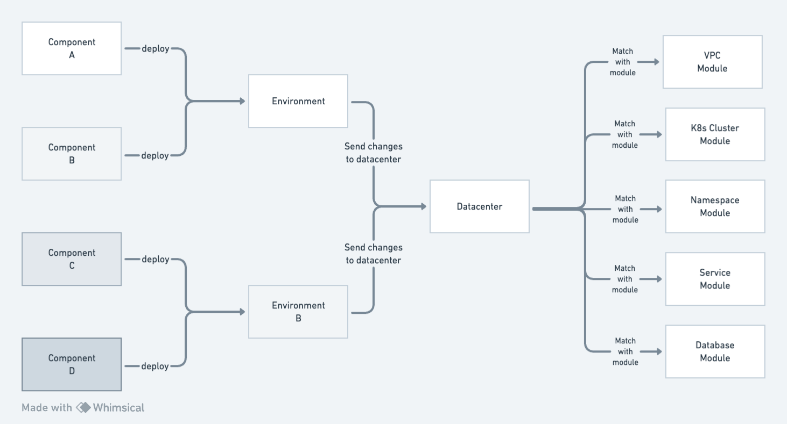

Architect works by cleanly facilitating the transformation of application configuration (Components)
into infrastructure configuration (Datacenters). Developers create Components, create Environments,
and deploy components into said Environments. Platform engineers on the other hand are responsible
for Datacenters, which in turn handle any of the resource and environment requests made by
Developers.

## The Developer workflow

With Architect, Developers are responsible for designing and deploying Components to Environments
that they create. Each environment is backed by a single datacenter, which is responsible for
creating and managing the infrastructure for that environment and all resources deployed into it.
Aside from specifying which Datacenter an Environment should be created in, Developers don't need to
know anything about creating or managing Datacenters.

1. **Write**: Create the `architect.yml` file representing your component. Inside will be all the
   databases, services, dependencies, and other application details needed for your Component to be
   run.
2. **Build**: Components get built from the `architect.yml` file into a portable, OCI-compliant
   image that can be published into any OCI artifact registry.
3. **Test**: Thanks to recursive delivery, Components automatically deploy their own dependencies.
   This means that every Components can be deployed to fresh environments and run integration tests
   on-demand or via common CI workflow triggers like pull requests.
4. **Deploy**: Once your satisfied with the test results, you can easily deploy the same Component
   artifact to any other environment. Even if that environment uses a completely different
   Datacenter.

## The Platform workflow

The workflow as a Platform Engineer should be very familiar for anyone who as worked with another
IaC tool, like Terraform, Pulumi, CloudFormation, etc. Create a Datacenter template, see what
changes it will yield to the datacenter, and apply changes when you're ready.

1. **Write**: Create your datacenter file (e.g. `datacenter.arc`). Inside will be instructions on
   when to provision various different [modules](../../04-datacenters/02-modules.mdx).
2. **Apply**: When changes are applied to the datacenter, Architect will ensure that relevant
   environments and cloud resources are all updated to match the new datacenter specification. The
   spec is then stored in the state file so that other developers can take advantage of it.

In a distributed product, team, or organization, Components may live in many different repositories
w/ each repository dedicated only to its own domain. Datacenters on the other hand are always
centralized making it easy to roll out infrastructure changes to your entire organization.

## Under the hood

It's easy to wave our hands and say "Components contain application configuration and Datacenters
contain infrastructure", but the devil is in the details. The lifecycle of a Component being
deployed to an environment can be summarized as follows:

1. **Component deployment**: Whenever a developer deploys a Component to an Environment, Architect
   merges in the Component configuration with the existing Environment configuration. The
   Environment configuration is stored in the [state backend](../04-state-management.mdx) the CLI
   has been configured to use.
2. **Resource extraction**: Once we have the target state of the Environment, Architect walks
   through every Component the Environment needs (both explicitly cited ones, and ones needed
   implicitly as a dependency of others). It extracts all the resources each Component needs, infers
   the relationships between each resource, and spits it out as an application graph.
3. **Datacenter enrichment**: Armed with a graph of resources that should exist in the environment,
   we then call on the Datacenter to find out what kind of infrastructure should be used for each
   resource. Each resource gets matched against a [hook](../../04-datacenters/04-hooks.mdx) in the
   datacenter that tells what modules to execute, how to configure them, and how to extract the
   output values needed for any resources that depend on it.
   - _The graph produced as part of resource extraction represents a contract between the Components
     and Datacenters. Each node contains a normalized input/output schema from one of Architect's
     [supported resources](../../04-datacenters/04-hooks.mdx), and the edges help determine which
     order to deploy the resources in. This helps Datacenters control the infrastructure without
     getting into the weeds of which resources depend on which others._
4. **Plan and apply**: By combining the extract resources with the infrastructure templates from the
   Datacenter, what we're left with at the end is basically an IaC template representing the target
   state of the environment. That means the final step is to generate the plan to determine what
   resources are changing, and execute said changes - just like other IaC tools.

Architect is NOT a rewrite of the IaC ecosystem. It's an abstraction on top of IaC that makes it
easier for Developers and Platform Engineers to collaborate and maintain an Internal Developer
Platform (IDP). IaC represented a huge leap in infrastructure management, and Architect is the
tactical push it needs to make it easier to maintain and contribute to at-scale.
